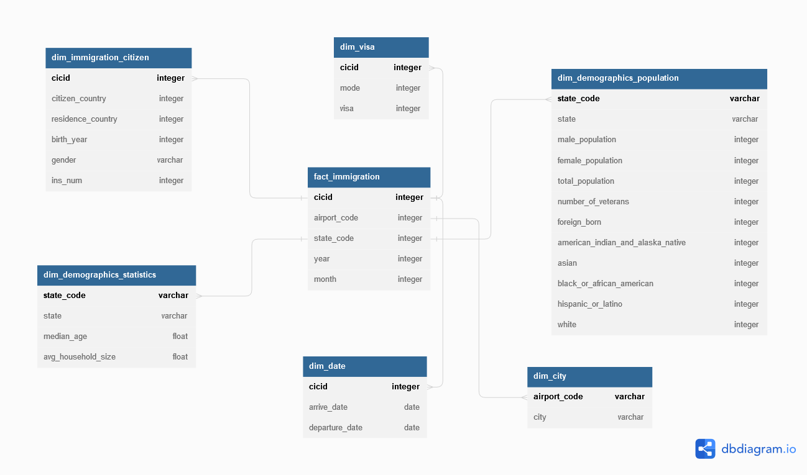

### Data Engineering Capstone Project

#### Project Summary
The project joins multiple datasets (I94 Immigration Data, U.S. City Demographic Data and Airport Codes) into one data warehouse with a star schema in order to make it easier for further analysis.

The project follows the follow steps:
* Step 1: Scope the Project and Gather Data
* Step 2: Explore and Assess the Data
* Step 3: Define the Data Model
* Step 4: Run ETL to Model the Data
* Step 5: Complete Project Write Up

### Step 1: Scope the Project and Gather Data

#### Scope 
Explain what you plan to do in the project in more detail. What data do you use? What is your end solution look like? What tools did you use? etc>

The project utilizes the data coming from variuos sources -listed below- to establish a data warehouse that can be used in analytics and collecting insights and metrics.

Datasets:
1. I94 Immigration Data.
2. U.S. City Demographic Data.
3. I94_SAS_Labels_Descriptions Data.

Tools used:
1. Pandas Libraries, to manipulate data.
2. PySpark, to process data in large scale efficintly. 
3. SqlAlchemy, to send data to AWS Redshift.
4. psycopg2, to query AWS Redshift.
5. AWS Redshift, to store the data warehouse.

#### Describe and Gather Data 
Describe the data sets you're using. Where did it come from? What type of information is included?

##### 1. I94 Immigration Data:
    
    Contains info about immigrants; arrive date, departure date, type of visa, city code and other data, provided by US National Tourism and Trade Office, the file type is CSV.

##### 2. U.S. City Demographic Data:
    
    Contains info about the demographics of all US cities and census-designated places with a population greater or equal to 65,000, provided by the US Census Bureau's 2015 American Community Survey, the file type is CSV.

##### 3. I94_SAS_Labels_Descriptions Data:
    
    Contains Countries, states, Airport and cities codes and names.
	
	### Step 2: Explore and Assess the Data
#### Explore the Data 
Identify data quality issues, like missing values, duplicate data, etc.

#### Cleaning Steps
Document steps necessary to clean the data

1. Removing rows with Null values on all columns.
2. Removing Duplicated rows.
3. Transforming Dates (arrdate, depdate) from Immigration table.
4. Parsing SAS file to get Country_Code, City_Code and State_Code.
5. Change letters case of "City" and "State" columns in "Demographics" table to upper case to match the data from SAS file.
6. Fill NaN values with 0.

### Step 3: Define the Data Model
#### 3.1 Conceptual Data Model
Map out the conceptual data model and explain why you chose that model

The data model uses star schema (Kimball model) to use the output in Analytics.

#### 3.2 Mapping Out Data Pipelines
List the steps necessary to pipeline the data into the chosen data model

1. Reading the data from the sources.
2. Cleaning the raw data.
3. Tranforming the data (Removing Nulls and Duplicates, transforming Dates, Parsing SAS file, etc.).
4. Creating the tables according to the star schema data model.
    1. Creating the fact and dimension dataframes out of the original dataframes.
    2. Changing the column names to a more understandable names.
5. Filling the AWS Redshift cluster DBtables with the transformed data.

#### 4.2 Data Quality Checks

1. Integrity, check if joinning the fact table's primary key with the dimensions table's primary Keys gives correct values,
    the process goes by droping all join matches, if the result is empty, then the data follows Integrity constraints. 
2. Redshift tables are not empty.

#### 4.3 Data dictionary 
Create a data dictionary for your data model. For each field, provide a brief description of what the data is and where it came from. You can include the data dictionary in the notebook or in a separate file.

| fact_immigration | Type      | Description                                                |
|------------------|-----------|------------------------------------------------------------|
| cic_id           | INT       | [Primary Key], an integer no. that represent the immigrant |
| year             | INT       | Integer representing the year the data is collected        |
| month            | INT       | Integer representing the month the data is collected       |
| airport_code     | varchar   | 3 charcters that represent the airport                     |
| state_code       | varchar   | 2 charcters that represent the state                       |

| dim_visa         | Type      | Description                                                |
|------------------|-----------|------------------------------------------------------------|
| cic_id           | INT       | [Primary Key], an integer no. that represent the immigrant |
| mode             | INT       | Integer that represent the visa mode                       |
| visa             | INT       | Integer that represent the visa type                       |

| dim_date         | Type      | Description                                                |
|------------------|-----------|------------------------------------------------------------|
| cic_id           | INT       | [Primary Key], an integer no. that represent the immigrant |
| arrive_date      | TIMESTAMP | Arrive date                                                |
| departure_date   | TIMESTAMP | Departure date                                             |

| dim_immigrationg_citizen  | Type    | Description                                                |
|---------------------------|---------|------------------------------------------------------------|
| cic_id                    | INT     | [Primary Key], an integer no. that represent the immigrant |
| citizen_country           | varchar | The country of citizenship of the immigrant                |
| residence_country         | varchar | The country of resiedence of the immigrant                 |
| birth_year                | INT     | Immigrant's birth year                                     |
| gender                    | varchar | Immigrant's gender                                         |
| ins_num                   | INT     | Immigrant's insurence number                               |

| dim_demographics_population       | Type    | Description                                            |
|-----------------------------------|---------|--------------------------------------------------------|
| state_code                        | varchar | [primary key], state code                              |
| state                             | varchar | state name                                             |
| male_population                   | integer | male population in the state                           |
| female_population                 | integer | female population in the state                         |
| total_population                  | integer | total population in the state                          |
| number_of_veterans                | integer | no. of veterans                                        |
| foreign_born                      | integer | no. of outcomers (born abroad)                         |
| american_indian_and_alaska_native | integer | count of  american_indian_and_alaska_native population |
| asian                             | integer | count of  asian population                             |
| black_or_african_american         | integer | count of  black_or_african_american population         |
| hispanic_or_latino                | integer | count of  hispanic_or_latino population                |
| white                             | integer | count of  white population                             |

| dim_demographics_statistics | Type    | Description                                         |
|-----------------------------|---------|-----------------------------------------------------|
| state_code                  | varchar | [primary key], 2 charcters that represent the state |
| state                       | varchar | the state name                                      |
| median_age                  | float   | the median age of population                        |
| avg_household_size          | float   | the average household size in the state             |

| dim_city     | Type    | Description                                       |
|--------------|---------|---------------------------------------------------|
| airport_code | varchar | [Primary Key], 3 char. that represnet the airport |
| city         | varchar | the city name                                     |

#### Step 5: Complete Project Write Up
#### * Clearly state the rationale for the choice of tools and technologies for the project.
    1. Pandas is used to manipulate the data in its easy-to-use dataframe
    2. AWS Redshift is used to hold the data in a data warehose that is distributed and widly accessable.
#### * Propose how often the data should be updated and why.
    1. Data that comes from Immigration dataset should be updated monthly.
    2. Data that comes from Demographics dataset should be updated annually.
    3. Data about Citys, States, and Countries should be updated on demand.
    4. Data about Airports codes should be updated on demand.
#### * Write a description of how you would approach the problem differently under the following scenarios:
#### * The data was increased by 100x.
     1. Apache Spark will be used instead of Pandas libiraries to leverage the advantages of distributed proccessing.
     2. AWS EMR will be used to easily manage the Apache Spark cluster.
#### * The data populates a dashboard that must be updated on a daily basis by 7am every day.
     1. Apache Airflow will be used to schedule the run of the pipline.
#### * The database needed to be accessed by 100+ people.
     1. AWS Redshift database can handle up to 500 connections simultaneously, to handle more than 500 connections, using another Airflow pipline to duplicate the database periodically to work as a load balancer would be a suggested solution.
	 
	 #### Pipline purpose
##### The is made to use the output in analytics and to be consumed by BI tools and in dashboards.
##### Users can accsess the output through AWS Redshift data warhouse, and they can use its API to connect to their apps and tools

